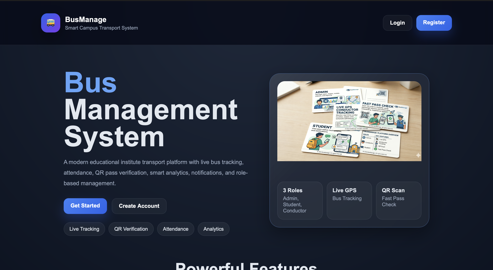
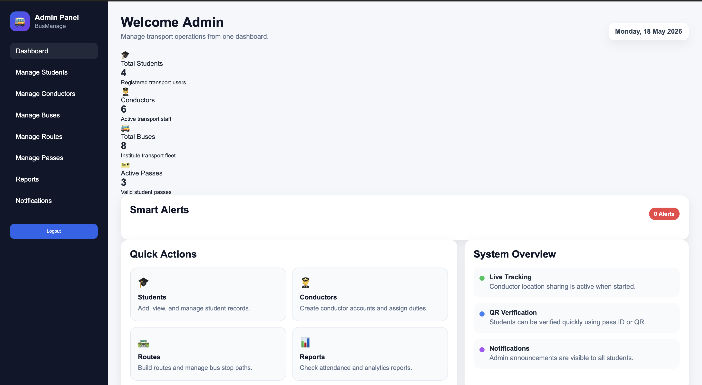
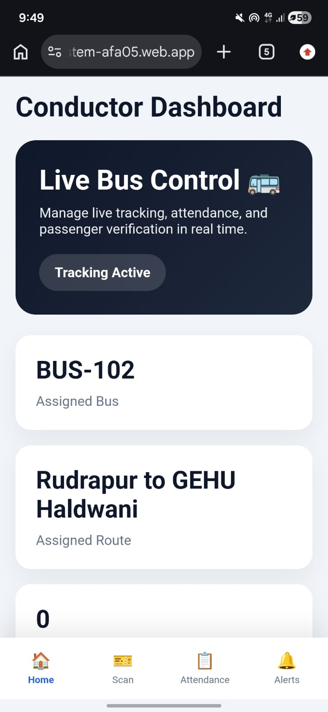
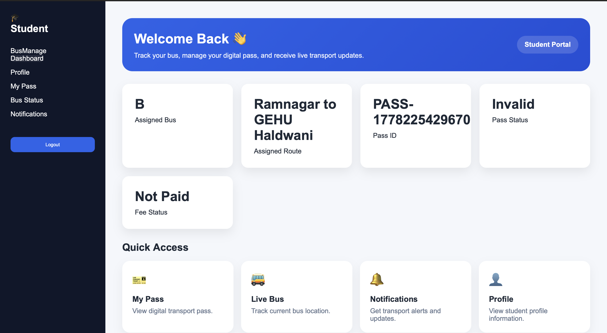

# 🚌 BusManage – Educational Institute Bus Management System

A modern smart transport management platform built for schools, colleges, and universities to simplify and digitize transportation operations.

---

# 🌐 Project Preview

## Landing Page

> Add your landing page screenshot here



---

## 👨‍💼 Admin Dashboard

> Add admin dashboard screenshot here



### Admin Features
- Manage Students
- Manage Conductors
- Manage Buses
- Manage Routes
- Manage Passes
- View Reports & Analytics
- Send Notifications
- CSV Bulk Import
- Approve Registration Requests

---

## 🧑‍✈️ Conductor Dashboard

> Add conductor dashboard screenshot here



### Conductor Features
- Verify Student Passes
- Mark Attendance
- Update Bus Status
- View Assigned Route
- Simulated Live Tracking

---

## 🎓 Student Dashboard

> Add student dashboard screenshot here



### Student Features
- View Pass Status
- Check Assigned Bus & Route
- Receive Notifications
- View Bus Updates
- Transport Access Management

---

# ✨ About The Project

BusManage is designed to provide a centralized transport workflow for educational institutes.

The platform combines:

- Student management
- Bus management
- Route handling
- Attendance tracking
- Pass verification
- Notifications
- Reports & analytics

into one unified dashboard experience.

---

# 🚀 Why This Project Stands Out

Unlike traditional transport systems, BusManage is not just a form management app.

It is designed as a complete workflow system with:

✅ Role-based dashboards  
✅ Smart transport management  
✅ Pass verification system  
✅ Attendance monitoring  
✅ CSV bulk import support  
✅ Analytics & reports  
✅ GPS-ready route structure  
✅ Responsive modern UI  

---

# 🛠️ Tech Stack

## Frontend
- HTML5
- CSS3
- JavaScript

## Backend & Database
- Firebase Authentication
- Cloud Firestore
- Firebase Hosting

## Libraries & Tools
- Chart.js
- PapaParse
- Service Worker

---

# 🔐 Authentication Workflow

## Student Registration Flow

1. Student submits registration request
2. Admin reviews request
3. Admin approves account
4. Firebase Authentication account is created
5. Temporary password is generated
6. Student logs in
7. Student can reset/change password

---

# 📊 Reports & Analytics

The reports module provides:

- Total students
- Total buses
- Attendance records
- Active vs expired passes
- Route usage statistics
- Bus activity overview

---

# 📥 CSV Import System

Admin can bulk import:

- Students
- Conductors
- Buses
- Routes

using CSV files.

This reduces manual data entry and improves scalability.

---

# 🌍 Smart Transport Features

## Current Features
- Route mapping support
- GPS-ready route structure
- Attendance management
- Pass validity tracking
- Notifications system

## Future Scope
- Real-time GPS tracking
- ETA prediction
- QR code scanning
- AI route optimization
- Mobile app integration

---

# 📱 Responsive Design

BusManage is fully responsive and optimized for:

✅ Desktop  
✅ Tablet  
✅ Mobile Devices  

---

# 📂 Project Structure

```bash
bus-management-system/
│
├── admin/
├── conductor/
├── student/
├── css/
├── js/
├── assets/
│
├── index.html
├── login.html
├── register.html
├── forgot-password.html
├── firebase.json
├── service-worker.js
└── README.md
